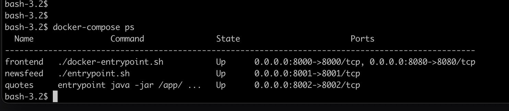
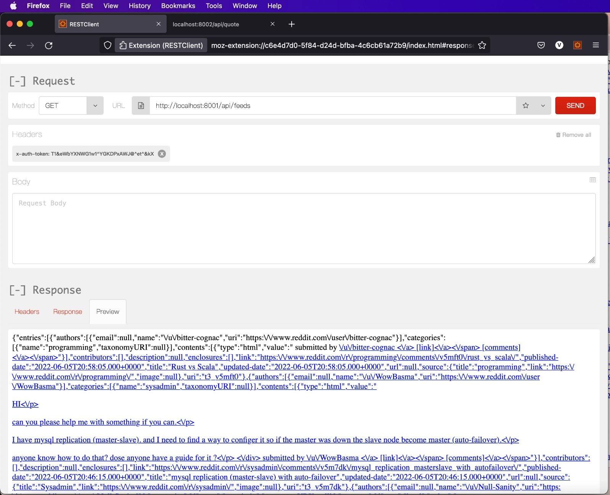
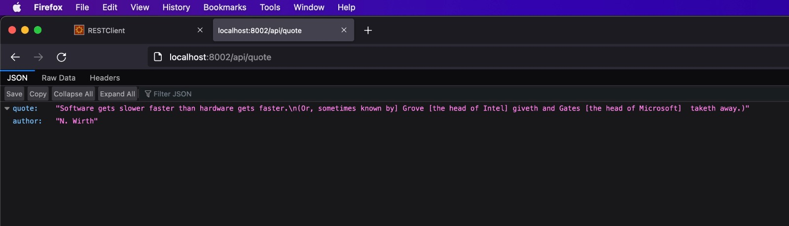

# thoughtworks

# Infrastructure Problem

Deploy Clojure app from this location [infra-problem repository](https://github.com/ThoughtWorksInc/infra-problem)

## Getting started

Deploy app & infra from local system.

## **Pre-requiste:**

1. AWS Account
2. Create IAM user and download Access key and Secret key
4. Install following packages on local system
    - Docker
    - docker-compose
    - Kubectl
    - Helm

## **Setup Infrastructure:**

1. Configure AWS Vault with access key, secret key, region using MFA
2. Run `deploy-infra.sh` script, this deploy AWS infra using terraform. (Takes around 10-15mins to deploy whole infra)

## **Setup Application**

Build and run the application locally through docker-compose. 
Commands used to build all the frontend and backend services `docker-compose build --no-cache`
While Command used to build only one of the service say quotes `docker-compose build --no-cache quotes`

Once the infra is ready you can proceed to building and deploying application.

----
# APP USAGE

This project contains three services:

* `quotes` which serves a random quote from `quotes/resources/quotes.json`
* `newsfeed` which aggregates several RSS feeds together
* `front-end` which calls the two previous services and displays the results.

## Prerequisites

* Java
* [Leiningen](http://leiningen.org/) (can be installed using `brew install leiningen`)

## Running tests

You can run the tests of all apps by using `make test`

## Building

First you need to ensure that the common libraries are installed: run `make libs` to install them to your local `~/.m2` repository. This will allow you to build the JARs.

To build all the JARs and generate the static tarball, run the `make clean all` command from this directory. The JARs and tarball will appear in the `build/` directory.

### Static assets

`cd` to `front-end/public` and run `./serve.py` (you need Python3 installed). This will serve the assets on port 8000.

## Running

All the apps take environment variables to configure them and expose the URL `/ping` which will just return a 200 response that you can use with e.g. a load balancer to check if the app is running.

### Front-end app

`java -jar front-end.jar`

*Environment variables*:

* `APP_PORT`: The port on which to run the app
* `STATIC_URL`: The URL on which to find the static assets
* `QUOTE_SERVICE_URL`: The URL on which to find the quote service
* `NEWSFEED_SERVICE_URL`: The URL on which to find the newsfeed service
* `NEWSFEED_SERVICE_TOKEN`: The authentication token that allows the app to talk to the newsfeed service. This should be treated as an application secret. The value should be: `T1&eWbYXNWG1w1^YGKDPxAWJ@^et^&kX`

### Quote service

`java -jar quotes.jar`

*Environment variables*

* `APP_PORT`: The port on which to run the app

### Newsfeed service

`java -jar newsfeed.jar`

*Environment variables*

* `APP_PORT`: The port on which to run the app

